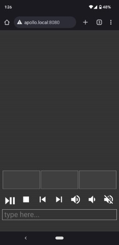

<p align="center">
  
</p>

--------------------------------------------------------------------


# Smart Control
## Smartphone Keyboard, Trackpad, and Media Controls for Windows Desktop


## Overview
Allows a smartphone to control the mouse and keyboard of a Windows desktop through the browser. No app install required! Devices must be on the same WiFi network. 
Useful for pausing, playing, and searching for videos from the couch!


## Screenshot



## Controls
The large empty area at the top is a trackpad similar to ones on laptops. Tap for single click. No multitouch implemented yet. The three buttons below are left, middle, and right click. Holding left click still allows you to use the trackpad to drag items or highlight text. 

Media buttons for: play/pause, stop, back, next, volume up, volume down, and mute. 

Send text with Android or iOS keyboard. Pressing `Enter` with blank text area will send `Enter`. Sending `Backspace` with blank text will send `Backspace`. 

The buttons in the bottom right will snap the cursor to the middle of the screens 1, 2, and 3. Hopefully you don't have more than 3 scerens because I was lazy and didn't implement dynamically populating the screen buttons with the actual number from your computer. 


## Installation/Running
1. Open port 8080 (details below) so that devices on your network can connect to the server. 
2. Download and extract `package.zip` from the Releases page. 
3. Run the executable


## Firewall 
In an elevated command prompt, run the following to allow access on local network:
```
netsh http add urlacl url=http://*:8080/ user=Everyone listen=yes
netsh advfirewall firewall add rule name="TCP Port 8080" dir=in localport=8080 protocol=TCP action=allow
```
To undo:
```
netsh advfirewall firewall delete rule name="TCP Port 8080"
netsh http delete urlacl  url=http://*:8080/
```
