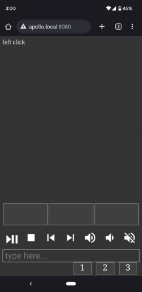

# HTTP Keyboard and Trackpad

## General
Allows a smartphone to control the mouse and keyboard of a Windows desktop through the browser. No app install required!

Useful for pausing, playing, and searching for videos from the couch


## Screenshot



## Firewall 

In an elevated command prompt, run the following to allow access on local network:
```
netsh http add urlacl url=http://*:8080/ user=Everyone listen=yes
netsh advfirewall firewall add rule name="TCP Port 8080" dir=in localport=8080 protocol=TCP action=allow
```
To undo:
```
netsh advfirewall firewall delete rule name="TCP Port 8080"
netsh http delete urlacl  url=http://*:8080/
```
